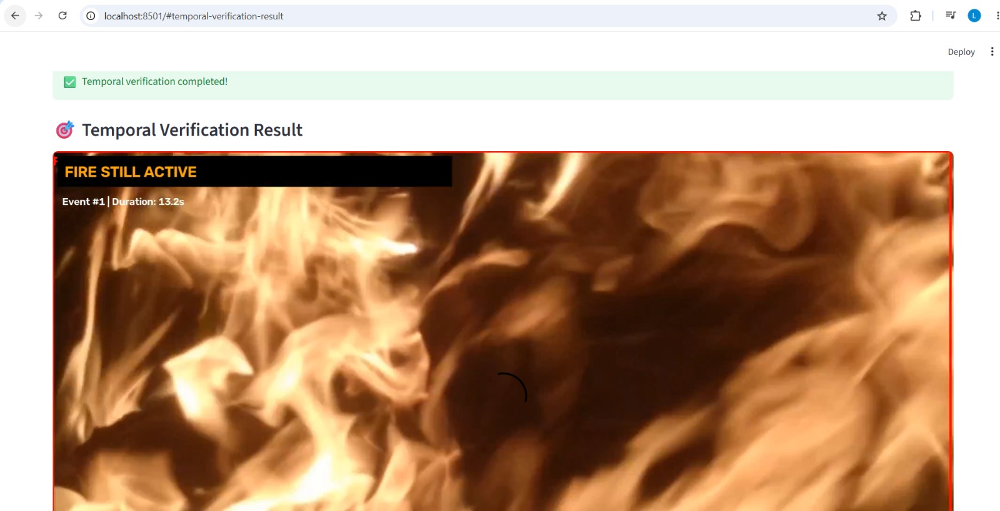

# Real-Time Forest Fire & Smoke Detection

An end-to-end deep learning computer vision system for detecting forest fire and smoke from images and videos. The system combines YOLO-based object detection with temporal verification to reduce transient false alarms and generate audio alerts for confirmed fire events.

---

## Project Overview

Forest fires can spread rapidly, making early detection important for timely response. This project develops a computer vision-based fire and smoke detection system that can analyze images and videos and identify potential fire or smoke events.

The system combines:

- YOLO11n object detection
- Temporal verification of detections
- Persistence-based event detection
- Audio alerts
- FastAPI inference backend
- React web dashboard
- Docker-based deployment
- Quantitative model evaluation using Precision, Recall, F1-score and mAP

---

## Project Goals

The system is designed to:

- Detect fire and smoke using YOLO object detection
- Evaluate model performance using Precision, Recall, F1-score and mAP
- Perform image and video inference
- Reduce transient false alarms using temporal verification
- Detect persistent fire events across multiple video frames
- Generate audio alerts based on event persistence
- Provide inference through a FastAPI backend
- Provide a user-friendly interface through React
- Package the complete application using Docker

---

##  System Architecture

```text
                Image / Video Input
                       │
                       ▼
                  React Dashboard
                       │
          ┌────────────┴────────────┐
          │                         │
          ▼                         ▼
    Image Detection          Video Detection
          │                         │
          ▼                         ▼
    FastAPI Backend        Temporal Verification
          │                         │
          ▼                         ▼
       YOLO11n              Event Confirmation
          │                         │
          ▼                ┌────────┴────────┐
   Fire / Smoke           │                 │
   Detection              ▼                 ▼
                    Initial Alert    Persistence Alert
                                          │
                                          ▼
                                  Escalated Alert
                                          │
                                          ▼
                                  H.264 Output Video
                                    + Audio Alerts


Model

The project uses a trained YOLO11n object detection model for detecting two classes:

Fire
Smoke
Model Details
Property	Details
Model	    YOLO11n
Task	    Object Detection
Classes	    Fire, Smoke
Framework	Ultralytics YOLO / PyTorch
Input	    Images and Videos

The trained model is stored at:

models/fire_smoke_yolo11n_best.pt


Model Evaluation

The trained YOLO11n model was evaluated on a held-out test dataset containing 1,113 images and 2,716 annotated instances.

Overall Results
Metric	        Score
Precision	    76.5%
Recall	        66.1%
F1-Score	    70.8%
mAP@50	        74.0%
mAP@50-95	    45.5%


Class-wise Results

 Class            Precision    Recall   F1-Score        mAP@50    mAP@50-95 

 Fire             72.0%      62.9%      67.5%       72.0%      41.8% 
 Smoke            81.1%|     69.3%      74.7%       76.1%      49.2% 
 Overall          76.5%      66.1%      70.8%       74.0%      45.5%


Evaluation Dataset
Test Images: 1,113
Test Instances: 2,716
Number of Classes: 2
Classes: Fire, Smoke

The evaluation was performed using the held-out test split rather than the training data.


Temporal Verification

A single-frame detection may be caused by transient visual patterns and may result in unnecessary alerts.

To reduce such false alarms, the system performs temporal verification across consecutive video frames.

Temporal Verification Parameters

Confidence Threshold : 0.5
Confirm Window       : 1.5 seconds
Confirm Ratio        : 0.60
Close Window         : 5.0 seconds
Close Ratio          : 0.85
Merge Gap            : 4.0 seconds


Event Verification Flow

YOLO Detection
      │
      ▼
Temporal Verification
      │
      ▼
60%+ positive detections
within confirmation window
      │
      ▼
Confirmed Fire Event
      │
      ├── Initial 3-Beep Alert
      │
      ▼
Event remains active
      │
      ├── Fast Persistence Alert
      │
      ▼
Event continues
      │
      └── Escalated Slow-Beeps Alert


The system also handles event closure and re-detection to avoid generating repeated alerts for the same continuing event.

Audio Alert System

The system generates different audio alerts depending on the state of the detected event.

Alert Levels

| Event State                 | Alert                   |
| --------------------------- | ----------------------- |
| Fire event confirmed        | 3 medium beeps          |
| Event active for 5 seconds  | Fast persistence beeps  |
| Event active for 15 seconds | Slower escalation beeps |

The generated alarm audio is combined with the processed video output.


Video Processing

The system supports video-based fire and smoke detection with temporal verification.

High-resolution videos are downscaled before inference to reduce memory consumption during containerized processing.

Video Processing Pipeline

Original Video
3840 × 2160
      │
      ▼
Frame Downscaling
1920 × 1080
      │
      ▼
YOLO11n Inference
      │
      ▼
Temporal Verification
      │
      ▼
Event Detection
      │
      ▼
H.264 Browser-Compatible Video
      │
      ▼
Audio Alerts Included


End-to-End Test Result

The complete Dockerized application was tested using a 30.89-second video.

Test Result

Input Resolution       : 3840 × 2160
Processing Resolution  : 1920 × 1080
Video Duration         : 30.89 seconds
Confirmed Fire Events  : 1
Total Audio Alerts     : 3
Output Format          : H.264 MP4


The temporal verification successfully:

Detected a fire event
Confirmed the event using temporal persistence
Generated an initial alert
Generated persistence alerts
Created the alarm audio
Generated a browser-compatible H.264 output video


Temporal Verification Demo

The React dashboard displays the confirmed fire event and its current temporal state:



FastAPI Backend

The project includes a FastAPI backend for serving the machine learning inference functionality.

Backend
http://localhost:8000

The API provides image-based fire and smoke detection and returns detection results including the detected class and confidence.


## React Dashboard

A React-based web dashboard provides the user interface for interacting with the fire and smoke detection system.

### Features

- Image upload and fire/smoke detection
- Detection confidence display
- Video upload
- Temporal verification
- Fire-event confirmation
- Processing status monitoring
- Confirmed event count
- Processed video playback
- Audio alert generation
- Result video download

### Frontend

The React frontend is served through Nginx in the Docker deployment.

```text
http://localhost:5173
```


## Docker Deployment

The application is containerized using Docker and Docker Compose.

The deployment consists of two services:

- FastAPI backend
- React frontend served through Nginx

### Services

| Service | Technology | Port |

| Backend | FastAPI + Python | 8000 |
| Frontend | React + Nginx | 5173 |

### Build and Start

```bash
docker compose up --build
```

Access the Application

React frontend:
```text
http://localhost:5173
```

FastAPI backend:
```text
http://localhost:8000
```


Stop the Application
```bash
docker compose down
```


## Technology Stack

- Python
- PyTorch
- YOLO11n
- Ultralytics
- OpenCV
- FastAPI
- React
- Nginx
- FFmpeg
- Docker
- Docker Compose
- Git / GitHub


## Project Structure

forest-fire-detection/
│
├── api/
│   └── main.py
│
├── frontend/
│   ├── src/
│   ├── Dockerfile
│   ├── nginx.conf
│   ├── package.json
│   └── vite.config.js
│
├── models/
│   └── fire_smoke_yolo11n_best.pt
│
├── src/
│   └── inference/
│       ├── predict.py
│       ├── temporal_detector.py
│       └── video_temporal.py
│
├── data/
│   └── videos/
│
├── screenshots/
│
├── notebooks/
│
├── tests/
│
├── Dockerfile
├── docker-compose.yml
├── start.sh
├── requirements.txt
├── .dockerignore
├── .gitattributes
├── .gitignore
└── README.md


Project Status
-Completed
 YOLO11n fire and smoke detection
 Image inference
 Video inference
 Temporal verification
 Fire-event persistence detection
 Audio alert generation
 4K to 1080p preprocessing
 H.264 browser-compatible output
 FastAPI backend
 React dashboard 
 Docker Compose deployment
 Nginx frontend serving
 Docker containerization
 End-to-end Docker testing
 Test-set model evaluation
 Precision evaluation
 Recall evaluation
 F1-score evaluation
 mAP evaluation
 GitHub version control


Limitations

Model performance may vary under different lighting, weather, camera angles, and environmental conditions.
The current evaluation is based on the available held-out test dataset.
The current system is an end-to-end Dockerized prototype and has not yet been hardened for large-scale production deployment.
Real-time IP/RTSP camera integration can be added as a future enhancement.
Additional testing on diverse real-world forest environments would improve confidence in generalization.


Future Improvements

Real-time RTSP/IP camera integration
GPU-accelerated inference
Improved model performance
Additional diverse training data
Cloud deployment
Production monitoring and logging
Automated email/SMS emergency notifications
Model versioning and monitoring
Large-scale performance and reliability testing


Author

Lakshmi Maniram
M.Tech Artificial Intelligence & Machine Learning